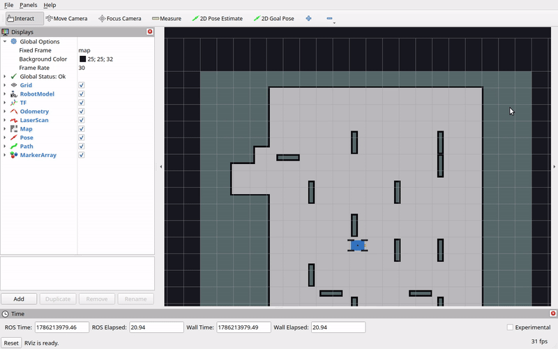
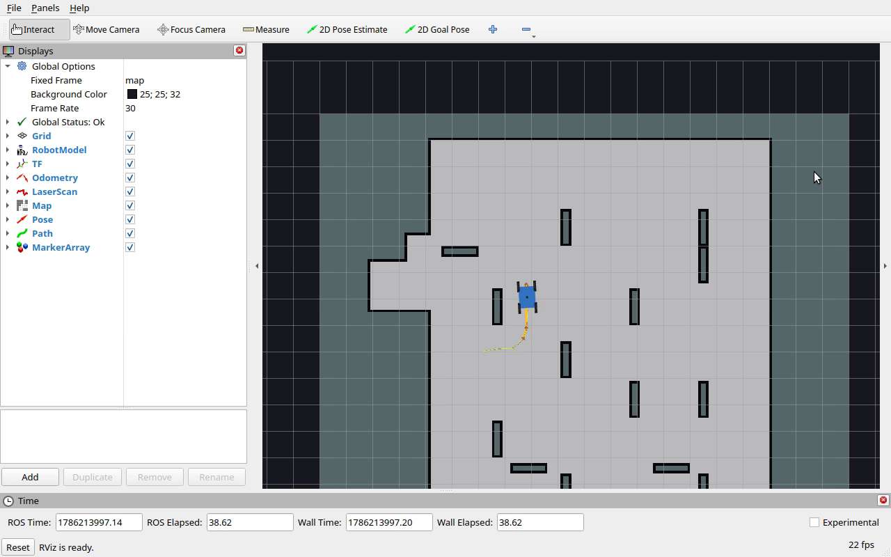
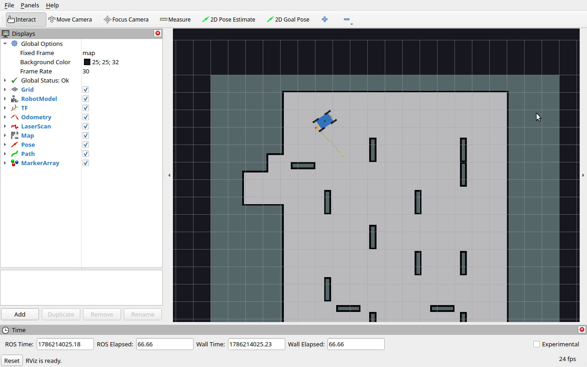
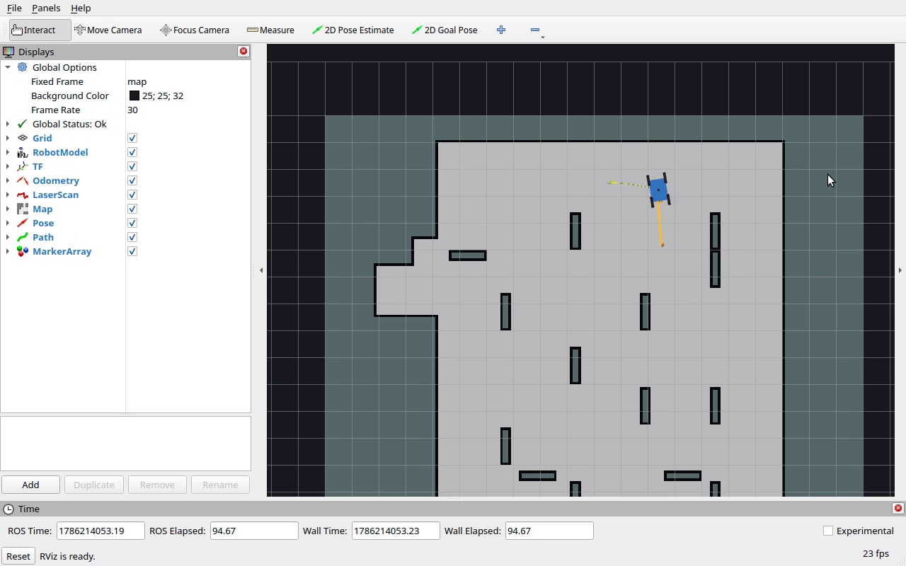

# vertex_planning

RRT path planning and waypoint following for a four-wheel omnidirectional robot in ROS 2.



## About

`vertex_planning` holds two ROS 2 (Jazzy) packages that together make up a complete
navigation loop for *vertex*, a large four-wheel omnidirectional base: a localizer that
corrects odometry against a stored map, an RRT planner that answers goal poses with a
path, and a follower that turns that path into wheel commands.

`packages` is the robot code. `shared169` is course support code — the
`PlanarTransform` class every node plans in, an ArUco detector, lidar and map-server
launch files, and the stored maps.

| Executable | Description |
| --- | --- |
| `planner` | RRT planner over the occupancy grid, publishes `/path` |
| `localize` | Scan-matches the lidar against the map, broadcasts `map -> odom` |
| `auto_vertex` | Follows `/path` waypoint by waypoint, publishes `/cmd_vel` |
| `odom_vertex` | Body twist to four wheel speeds, integrates pose, broadcasts `odom -> world` |
| `wheelcontrolplus` | Wheel servo against encoder counts |
| `encoder`, `gyro`, `driver` | Hardware drivers for the physical base |

The planner searches in (x, y, θ). It grows a tree with a 0.125 m step and a 10 percent
goal bias, checking every candidate by stamping a rotated footprint mask over the
occupancy grid:

```
mask = imutils.rotate(ROBOT, -theta)
free = not np.any(mapdata[v-9:v+10, u-9:u+10] & mask)
```

Two masks are used. `ROBOT` is the rectangular body outline, applied to tree nodes and to
every intermediate pose along an edge; `ROUND_BOT`, a disk of radius nine cells, is
applied to goals, so a goal has to sit in genuinely open space while the path itself may
thread a corridor. Edges are checked with a van der Corput sequence — the midpoint
first, then progressively finer subdivisions — so a blocked edge is usually rejected
after a handful of tests instead of a full sweep. Successful paths are then shortcut by
`post_process`, which drops any waypoint whose neighbours connect directly.

The planner takes work from three places. A `PoseStamped` on `/planner_goal_pose` is a
one-shot goal. A `PoseWithCovarianceStamped` on `/initialpose` arms an autonomous
coverage mode that samples its own random goals in the parts of the map it has not
visited yet. A `PowerPelletInfo` on `/pacman_info/power_pellet_info` redirects it at a
pellet — this code was written for a robot Pac-Man game, which is also why it imports
`pacman_msgs`.

`autodrive` drives to one waypoint at a time. It turns in place until the heading error
is under 0.2 rad, drives at up to 1.5 m/s with a proportional-plus-derivative law on
range, then turns again to the waypoint's own orientation before popping it off the
queue. Lidar returns are binned into six bumper zones whose thresholds grow with speed,
and a blocked zone zeroes the offending velocity component and raises `/bool`, which the
planner treats as a request to replan.

## Running it without a robot

The repository is the robot half of the system: it expects wheels, encoders, a gyro, an
RPLidar, and a camera. Three things it needs are also not in the repository at all —
the `bot_description` URDF, the `pacman_msgs` interfaces, and any of the game
infrastructure. The `vertex_media/` directory in this repository supplies enough to
run the planning stack on a laptop, with no hardware attached:

| Missing piece | Stand-in |
| --- | --- |
| `bot_description/urdf/vertex.urdf.xacro` | `vertex_media/vertex.urdf`, dimensions taken from the constants in `odom_vertex.py` |
| `pacman_msgs` | `vertex_media/pacman_msgs`, three message definitions inferred from how the planner reads them |
| Wheels and encoders | `odom_vertex.py` itself — its `simulate_drive` integrates `/cmd_vel` directly and broadcasts the same `odom -> world` transform the real one would |
| Lidar | Nothing. Without `/scan` the localizer runs open-loop and the planner plans against the stored map alone |
| A human clicking goals in RVIZ | `vertex_media/goal_sender.py`, which walks the robot through a fixed tour |

Nothing moves until a goal arrives, so `goal_sender.py` is what makes the demo a demo.
It publishes waypoints on `/planner_goal_pose` in the `grid` frame, waits for the robot
to arrive, and sends the next one.

## Setup

```bash
source /opt/ros/jazzy/setup.bash
cd ~/robotws                     # the colcon workspace holding this repo
colcon build --base-paths vertex_planning --symlink-install
source install/setup.bash
```

`planner.py` imports `imutils`, which is not a ROS dependency:

```bash
pip install --break-system-packages imutils
```

## Usage

```bash
ros2 launch vertex_planning/vertex_media/demo.launch.py
```

That brings up the map server on `churchsidemaze1b`, RVIZ, `localize`, `planner`,
`autodrive`, `odom_vertex` as a kinematic simulator, and — after a 25 second pause while
the planner precomputes its wall-distance table — `goal_sender.py`. Pass `goals:=false`
to bring up the stack without the tour and send goals yourself, either with the *2D Goal
Pose* tool in RVIZ or from the command line:

```bash
ros2 topic pub -1 /planner_goal_pose geometry_msgs/msg/PoseStamped \
  "{header: {frame_id: grid}, pose: {position: {x: 15.6, y: 27.0}, orientation: {w: 1.0}}}"
```

Goals are in the `grid` frame, whose origin is the map's lower-left corner, so the
40 m × 40 m map runs from (0, 0) to (40, 40) and the world origin sits at (19, 19).

`churchsidemaze1b` is the map to use. It is 200 × 200 cells at 0.2 m, which is the only
one of the six stored maps that matches the resolution and extent the planner has
hard-coded in `RES`, `WIDTH`, and `X_MAX`; the others are between 0.025 m and 0.1 m per
cell, and RRT would spend most of its samples outside them.

## Results

The robot covers a nine-waypoint tour — about 33 m of maze, up the western corridor,
east along the top, and back down the far side — in 80 seconds, replanning at each
waypoint. The orange line is the current `/path`, and the arrow at its end is the goal
orientation.

| Into the corridor | Around the top corner | Down the east side |
| --- | --- | --- |
|  |  |  |

Per-leg times for the recorded run, in seconds: 8.5, 5.5, 11.0, 12.5, 4.0, 11.5, 3.5,
11.0, 12.0. Planning itself is a small part of that — a 4 m leg plans in well under a
second — and the rest is the follower stopping and squaring up at every waypoint the
RRT produced.

Full clip: [`vertex_media/vertex_demo.mp4`](vertex_media/vertex_demo.mp4), 85 seconds
at 15 fps.

## Recording the demo

`vertex_media/record_demo.sh` reruns the demo and regenerates the video, the GIF, and
six stills:

```bash
./vertex_planning/vertex_media/record_demo.sh
```

This workstation runs a Wayland session with a rootless Xwayland, where grabbing the X11
root window returns solid black, so the script starts a nested `Xephyr` server on display
`:9`, runs RVIZ inside it with software GL, and points `ffmpeg -f x11grab` at that
window. RVIZ is started first and `goal_sender.py` only once the recording is rolling,
since the map on its own is a still image.

The script also kills any previous copy of the stack before starting. That is not
housekeeping: two `odom_vertex` nodes both broadcasting `odom -> world` make the robot
appear to teleport between two positions, and the symptom in RVIZ looks like a planning
bug rather than a duplicate process.

## Known behavior

**The default start pose is not plannable.** With no `/initialpose`, `map -> odom` is the
identity and the robot sits at grid (19, 19). Inflated by the footprint mask that cell
is occupied, so `rrt` rejects the start node and every goal comes back as *Couldn't find
path*. The robot has to be placed somewhere with nine cells of clearance before it can
be sent anywhere, which is what `goal_sender.py` does first.

**RRT cost grows sharply with distance, and failure is expensive.** Sampling is uniform
over the whole 40 m × 40 m grid at a 0.125 m step, and the nearest-node search is a
linear scan, so the work per step grows with the tree. Short legs are usually cheap:
timed offline from the nominal waypoints, every leg of the tour plans in under a second.
A goal on the far side of the maze exhausts the 100 000-step cap instead — and because
the search runs inside the subscriber callback, the node is deaf for the whole time. Two
of the longer legs that were tried and rejected took up to four minutes to fail. Keeping
goals about 4 m apart is what makes the demo work at all.

It does not make it deterministic. The follower stops within 0.35 m of a waypoint at
whatever heading it arrived with, and from some of those offset start poses even a 4 m
leg lands in the expensive case. Roughly one run in three has a leg that stalls, times
out after 75 seconds, and is picked up again at the next waypoint; the run recorded
above had none.

**Sending a goal again while the planner is busy makes things worse**, since the resends
queue up behind the search in progress. `goal_sender.py` only resends after the robot
has been motionless for 25 seconds.

**`/initialpose` does double duty.** The same message that tells the localizer where the
robot is also arms the planner's random coverage mode, which then competes with scripted
goals. The demo launch remaps the planner's subscription to `/planner_initialpose` so
the two can be separated.

**In simulation the odometry and the follower chase each other.** `odom_vertex`
integrates and republishes on every `/cmd_vel`, and also on a 200 Hz timer, while
`autodrive` answers every `/odom` with a fresh `/cmd_vel`. On the real robot the wheel
encoders pace that loop; in simulation nothing does, and the two nodes will each take
about a full core.

**Two console scripts point at modules that do not exist.** `setup.py` declares
`autodrive = packages.autodrive:main` and `wheelcontrol = packages.wheelcontrol:main`,
but only `auto_vertex.py` and `wheelcontrolplus.py` are in the tree, so those two names
build fine and fail at launch. `robot.launch.py` still refers to the working ones.

**`localize.py` used `np.int`**, removed in NumPy 1.24, so the node raised
`AttributeError` on startup under any current NumPy. The two occurrences are now plain
`int`; this is the only change made to the repository's own code.
